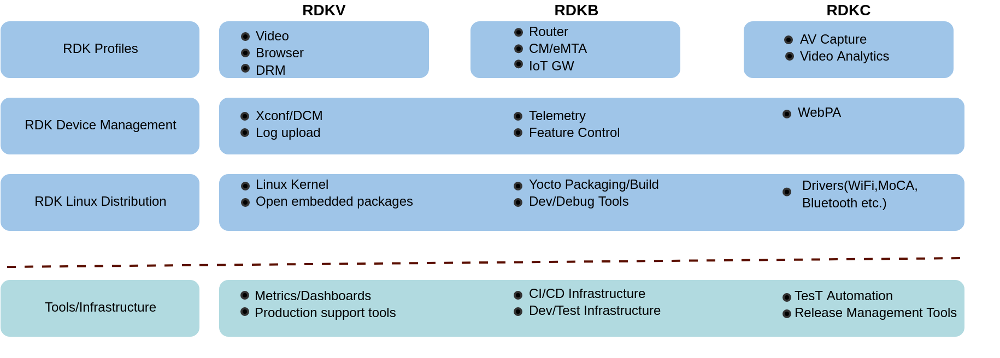

# Device Management

------------------------------------------------------------------------

Remote management of CPE devices, including monitoring, configuring, updating, and maintaining devices plays a crucial role in ensuring the smooth operation of connected devices, optimizing performance, and enhancing security and is critically important for supporting large-scale deployments.
The significance lies in its ability to horizontally scale across these profiles, allowing for the efficient sharing of the same code. This streamlined approach facilitates controlled bulk operations and data retrievals, essential for managing diverse devices at scale. The functionality extends to enabling or disabling features dynamically and facilitating firmware (code) downloads. Moreover, Device Management plays a crucial role in retrieving field matrices, ensuring a comprehensive and organized approach to overseeing and controlling devices within the specified frameworks.

The below diagram depicts how device management is horizontally
scaled between different RDK profiles and how the device management fits in RDK.

------------------------------------------------------------------------

## Device Management capabilities

Different device management capabilities are shared across the different profiles. The key device management capabilities are:

### Xconf/DCM

XCONF/DCM is a pivotal device management service that enables streamlined code download in set-top-boxes (STBs), providing essential information on firmware version, download source, and download protocol. It overcomes limitations of traditional code downloads by employing the eSTB interface for code download.

### Log Upload

Log Upload is an integral component in RDK deployments, allowing for debugging and maintenance. STBs store logs for a limited period, aiding in troubleshooting, field matrices, and problem urgency assessment. Controlled log uploads can be configured based on device maturity and occur at regular intervals.

### RDK Feature Control(RFC)

RDK Feature Control (RFC) addresses challenges in feature deployment and rollback procedures by providing a secure channel for delivering runtime configurations. It enables quicker feature rollouts, dynamic configurations, and control over feature enable/disable states without relying on firmware reversion.

### Telemetry

RDK Telemetry represents an improvement in data transfer mechanisms, moving beyond log file bundling. It involves periodic transmission of telemetry data from every RDK device and utilizes logs, system status information, and SNMP commands to enhance data transmission efficiency.

### WebPA

WebPA (Web Protocol Adapter) serves as a secure web protocol messaging system for bi-directional communication between cloud servers and RDK devices. It offers read/write access to device management parameters, prioritizing security and performance, and replaces traditional methods like TR-69 or SNMP.

In summary, RDK Device Management encompasses XCONF/DCM, Log Upload, Telemetry, RFC, and WebPA as comprehensive tools for efficient management and monitoring of RDK-based devices, ensuring optimal performance, security, and user experience.

------------------------------------------------------------------------

## Additional Resources

To know more about device management functionalities and how it is achieved, please refer below links:

-   [Code Download (Xconf, DCM)](https://wiki.rdkcentral.com/display/RDK/Code+Download+(Xconf,+DCM))
    Xconf/DCM
-   [Log Upload](https://wiki.rdkcentral.com/display/RDK/Log+Upload)
-   [Telemetry](https://wiki.rdkcentral.com/display/RDK/Telemetry)
-   [RDK Feature Control - RFC](https://wiki.rdkcentral.com/display/RDK/RDK+Feature+Control+-+RFC)

