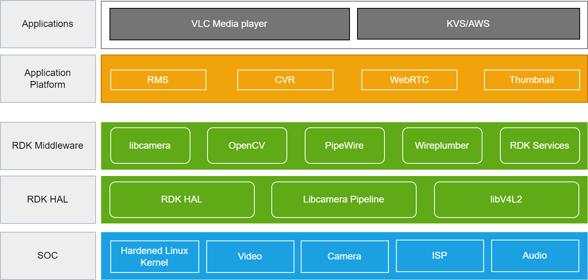

# RDK Camera Architecture

------------------------------------------------------------------------

  

RDK-C provides a common set of software components to build IP-based video cameras with standard functions, such as live streaming, continuous video recording and Normal Thumbnail. RDK accelerates the deployment of next-gen IP camera products and services, while simplifying the customization of the application and user experience.

------------------------------------------------------------------------

# Architecture Details

Below is an illustrative representation of the RDK Camera software stack, depicting the various components and their interactions.

At its core, RDK Camera consists of five main stack levels, each serving a specific purpose in the overall architecture. These levels are as follows:

## Application

VLC and KVS applications are sophisticated blends of continuous video recording (CVR). VLC is capable of ingesting a single live H.264 video stream from RMS. On the other hand, KVS (Kinesis Video Streams) offers CVR support. With KVS, you only pay for what you upload from the CVR application.

## Application Platform

The application platform is a robust system incorporating RMS , CVR , and WEBRTC technologies. RMS provides network live streaming. The incorporation of CVR allows continuous video recording, providing users with uninterrupted access to recorded content. Additionally, the platform leverages WEBRTC for high-quality real-time communication over the web. Thumbnail previews are integrated, offering users a quick and convenient way to navigate and preview content, enhancing the overall user experience.

## RDK Middleware

The RDK middleware is a powerful framework that integrates various functionalities, including libcamera for camera support, OpenCV for computer vision capabilities, PipeWire for multimedia handling, WirePlumber for audio management, and RDK services for comprehensive service integration. Libcamera ensures efficient camera functionality within the middleware, while OpenCV enhances computer vision capabilities for applications. PipeWire facilitates seamless multimedia handling, offering a versatile solution for audio and video processing. WirePlumber ensures effective audio management within the middleware. RDK services provide a comprehensive suite of services, creating a robust and extensible middleware framework with broad functionality and support for diverse applications.

## RDK HAL

The RDK Hardware Abstraction Layer (HAL) is a crucial component that interfaces with hardware-specific functionalities in the RDK environment. RDK HAL leverages the libcamera pipeline for efficient camera integration, enabling streamlined communication between the hardware and higher-level software components. Additionally, it utilizes libv4l2, providing a standardized interface for video capture devices. The combination of RDK HAL, the libcamera pipeline, and libv4l2 ensures seamless integration and optimal utilization of hardware resources, enhancing the overall performance and functionality of RDK-based systems

## SOC

The System-on-Chip (SoC) functionalities encompass a range of capabilities crucial for system operation. The Linux kernel serves as the core operating system, providing a stable foundation for software applications. SoC functionalities include camera and video drivers that facilitate communication between the hardware and software layers, enabling the utilization of imaging devices.

Moreover, Image Signal Processing (ISP) plays a pivotal role in enhancing and refining image quality. Integrated into the SoC, ISP manages tasks such as color correction, noise reduction, and other image processing operations to optimize the output from imaging sensors.

In summary, the SoC functionalities involve the orchestration of the Linux kernel, camera and video drivers, and ISP, collectively ensuring efficient communication with hardware components and enabling advanced image processing capabilities.

------------------------------------------------------------------------

# Application Scenario

In this application scenario, the user aims to achieve smooth playback of live streaming content using the VLC media player, which operates at the application layer. To accomplish this, a multi-layered architecture is employed. At the application platform layer, the RMS (RDK Media Streamer) component takes charge of managing the streaming process. Within the RDK (Reference Design Kit) ecosystem, RMS utilizes Pipewire, a middleware layer that facilitates the streaming functionality. Pipewire, in turn, relies on the capabilities of libv4l2 at the RDK HAL (Hardware Abstraction Layer) level. At the HAL layer, the libv4l2 component interfaces with the camera driver embedded in the SOC. This integrated system ensures a seamless and coordinated flow of live streaming content, starting from the hardware level camera driver and reaching the VLC media player at the application layer. Throughout this process, RMS acts as a crucial intermediary component within the RDK framework.

------------------------------------------------------------------------

# Useful Links

-   To know about the 
    available RDK-C components and its source code repo paths refer
    [Components List](https://wiki.rdkcentral.com/display/RDK/RDK-C+Components+List)
-   For
    bringing up and validation of Continuous video recording functionality in RPI refer
    [CVR](https://wiki.rdkcentral.com/pages/viewpage.action?pageId=103583530)
-   For video playback with WebRTC follow
    [WebRTC](https://wiki.rdkcentral.com/pages/viewpage.action?pageId=193144864)
-   For
    bringing up and validation of Normal Thumbnail functionality in RPI refer
    [Thumbnail](https://wiki.rdkcentral.com/display/RDK/RDK-C++Normal+Thumbnail)
-   To know more about libcamera for camera support refer
    [Libcamera](https://wiki.rdkcentral.com/display/RDK/RDK-C+%3A+Libcamera)
-   To know more about pipeWire, how it handles multimedia refer
    [PipeWire](https://wiki.rdkcentral.com/display/RDK/RDK-C+%3A+PipeWire)
-   To know about RDK-C RPI build guides refer
    [RDK-C RPI](https://wiki.rdkcentral.com/display/RDK/RDK-C)

